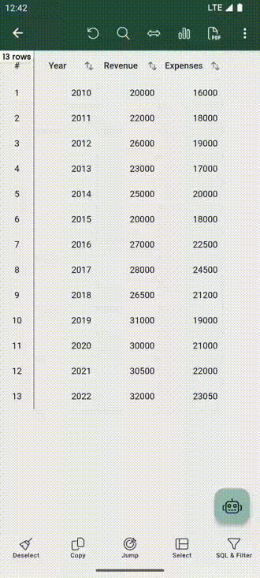

# AI assistant for querying data. :material-professional-hexagon:{ .pro title="Available for PRO version only" }

Crafting manual SQL queries for data analytics can be tedious and dull. Fortunately, we have an `AI assistant`
ready to make the process effortless for you. Simply click on the :fontawesome-solid-robot: icon and engage in 
a conversation with the assistant to effortlessly query your data.

Here is an example:

=== "AI assistant for querying data"
    { width="300" loading=lazy }

## How does it work?
The `AI assistant` sends the column names and your query to the OpenAI service, then retrieves the SQL query.
Finally, SmartCSV runs that SQL query locally and displays the data.

## Privacy
- Smart CSV only sends column names and your query to the OpenAI service.
- The app receives the SQL query response from OpenAI and runs that SQL query locally to filter data.
- Your actual data remains completely safe on your local machine and is never sent to OpenAI.
