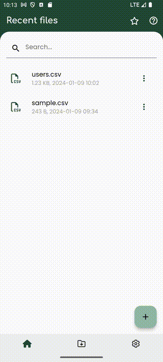

# Align columns :material-professional-hexagon:{ .pro title="Available for PRO version only" }

By default, SmartCSV aligns number columns to the right and text columns to the left. However, there are instances when you may need to customize the alignment for each column.

Here's a simple guide on how to achieve this customization:

- Look for and click on the icon that consists of `three dots`. You'll usually find this in the upper right corner of the screen.

- From the options that appear, select `Align columns`

- Upon opening the dialog box, a list of columns will be presented. You can easily customize the alignment for each column by selecting your preferred alignment option.

- Once you've made your selection, simply click the 'Apply' button to see the changes take effect.

=== "Align columns"
    { width="300" loading=lazy }

!!! note
    Within the column selection dialog, you have the option to streamline the process further. By clicking the 'Auto' button, SmartCSV to automatically align number columns to the right and text columns to the left.