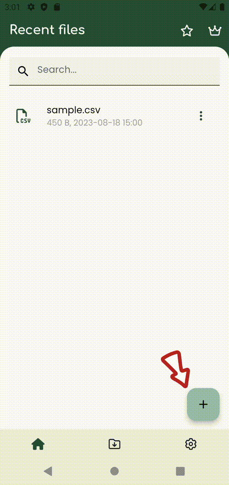
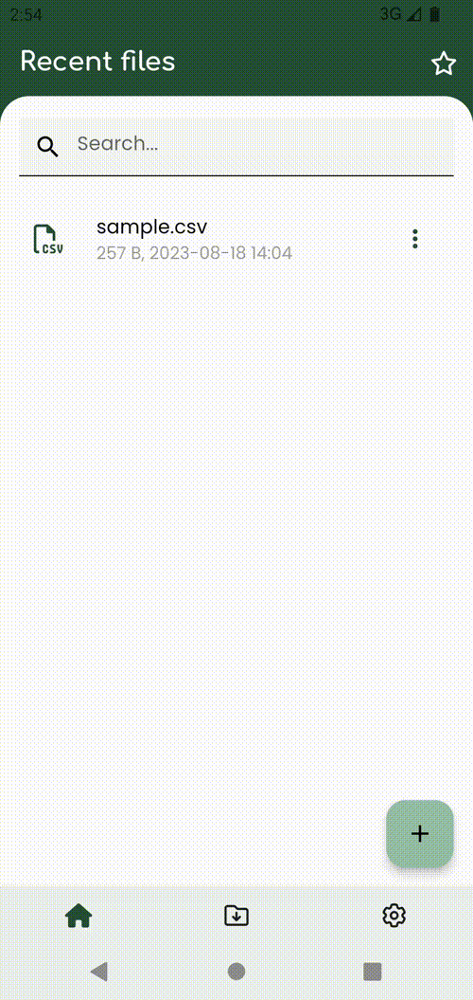
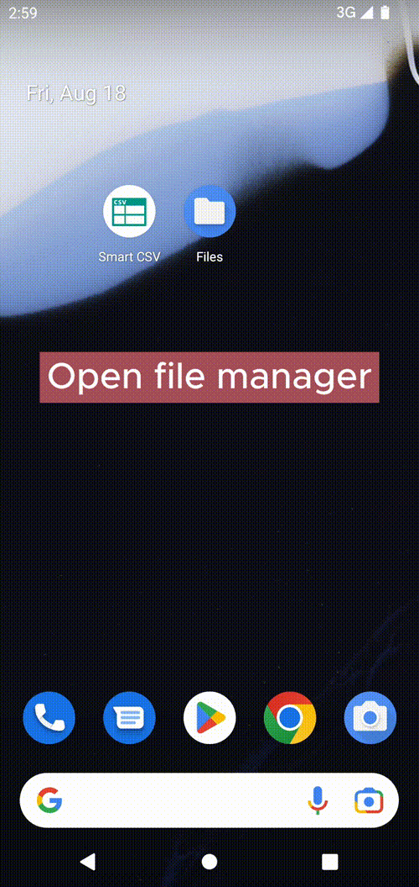
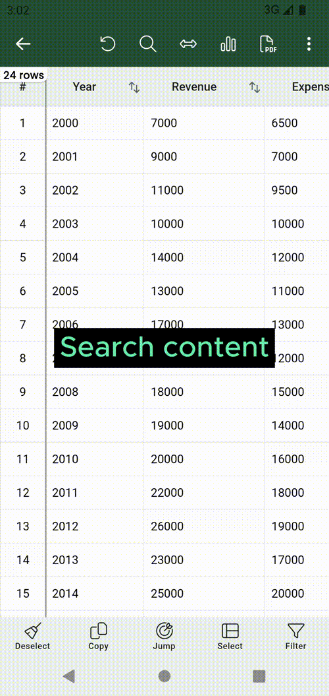
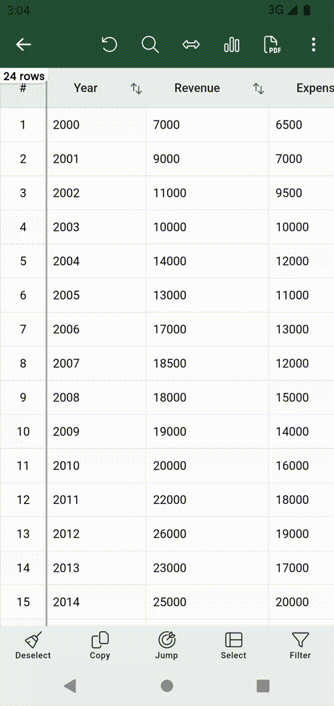
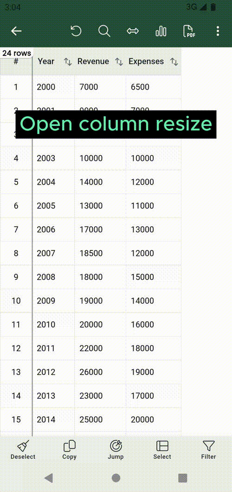
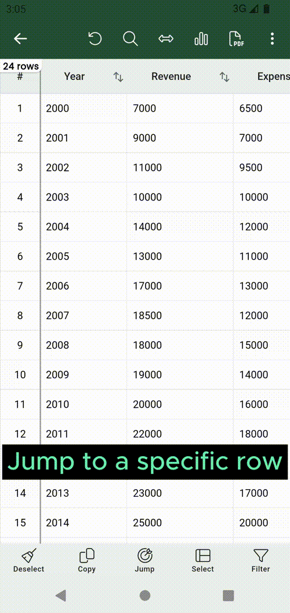
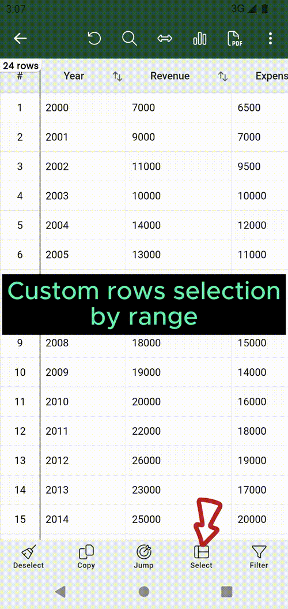
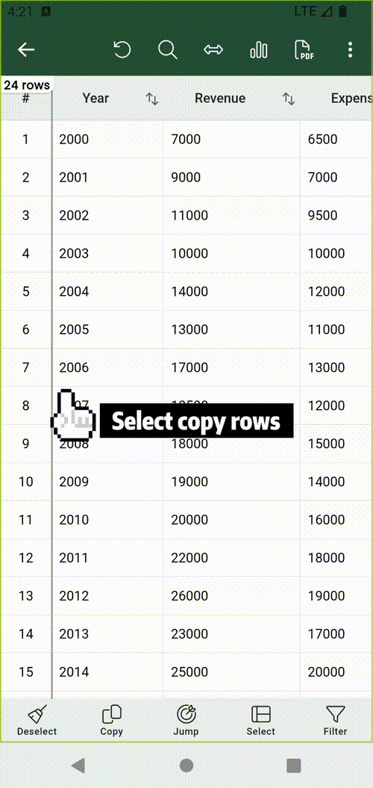
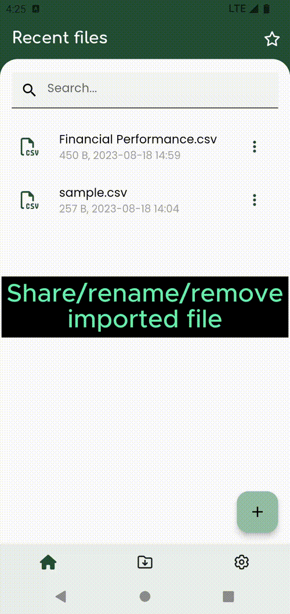

# Basics

## Open file
There are 2 ways to open a csv file:

- [Open from Smart CSV app](#open-from-smart-csv-app)
- [Open from File explorer](#open-from-file-explorer)

### Open from Smart CSV app
- Click on the `+` button.
- `Before Android 13` On the first time, the app will ask permission to open file. So please choose `Allow` to let app access the file.
- After you given the permission, the file picker will be shown, and choose the csv file that you want to open.
- The csv file will be imported to the app, and then the csv viewer will display the csv content.

=== "Before Android 13"
    { width="300" loading=lazy }

=== "Android 13 or Higher"
    { width="300" loading=lazy }

### Open from File explorer
- Open your favorite file explorer application (eg. `Files`).
- Navigate and click on the csv file you want to open.
- The dialog `open with` will be shown.
- Scroll & select `Smart CSV` to use to view the csv file.

=== "Open csv file from File Manager"
    { width="300" loading=lazy }

!!! note
    All file, after open will be listed in the `Recent files`.

    The first time open big CSV file, it may take some time.  
    But the next time, after the CSV file is imported, it will be open immediatelly.

---

## Search
Smart CSV let you search content easily. Once the csv file is openned, you can click on the search icon :octicons-search-24:
After the search box open, you can type the text you want to find.

Smart CSV will auto navigate and highlight the row that contain the searched text.
You can also using arrow buttons to move next/previous row match with the search text.

=== "Search content"
    { width="300" loading=lazy }

---

## Column resize

By default Smart CSV auto resize columns automatically. But in some case, you want to resize column manually.
To do that, you have two options:

### Manualy drag to resize

You can long press on the header, then the resize indicator will be shown. Now you can drag to resize the column width.

=== "Manual resize"
    { width="300" loading=lazy }

### Change all column width to the same value.
Click on the resize column button :left_right_arrow:
After the resize dialog show, input the column width that you want to set to all columns (eg: 75)
Finally, click on the button `Custom`. Now all the columns will have the same with.

To restore the automatically resize, you can click on the resize column button :left_right_arrow:
Then click to button `Auto`, then all columns will be set site automatically as default.

=== "Auto resize"
    { width="300" loading=lazy }

---

## Jump to
Your data is so long, you don't want to scroll long time till the specific row.
Smart CSV let you jump to the specific row instantlly.
You just need to click on the jump button, then type the row number, and finally click on the `Select` button to jump to
that row number.

In that dialog, you can also click on the `Begin` to jump to the first row, or click on the `End` to jump to the last row.

=== "Jump to"
    { width="300" loading=lazy }

---

## Select range

Smart CSV has a tons of features, such as copy, generate chart, export to pdf.
In order to do that, the user have to select which rows to be handled(the rows that highlight).
So instead touch each single row, Smart CSV support `Select range` feature to help you select data more easilly.

To do that, you just need to click on the button `Select`.
The dialog `Select range` will be shown.
Now, input the `from` and `to` values. Eg: from = 500; to = 1000
Then click on the button `Select`.

Now the row number from 500 - 1000 will be selected.

Then, you can use feature export pdf, generate chart or copy with the selected rows.

=== "Select range"
    { width="300" loading=lazy }

---

## Copy
Smart CSV let you copy data flexible.
Firstly, you need to select rows you want to copy. If there is no selected rows, the all rows will be
selected. You can also use [Select range](#select-range) feature to custom range selection.

Next, click on the copy button at the bottom of the screen. The copy dialog will be shown.
In the dialog, you can select which columns will be copy. You can see the result in the preview screen.

Finally, click on the `Copy` button. The selected content will be copy to the clipboard.
Now, you can paste that content anywhere as you want.

=== "Copy"
    { width="300" loading=lazy }

Sometimes, you just want to copy the content of a single cell.
To do that, you just need long press on that cell, the cell detail dialog will be shown.
There is a copy button on the top right of the dialog.
Click to that icon to copy the content.

## Share, rename, remove files.
In the home screen, in `Recent files` you can click on the three dots button.
Then, you can choose either share/rename/remove that file.

=== "Share, rename, remove file"
    { width="300" loading=lazy }

