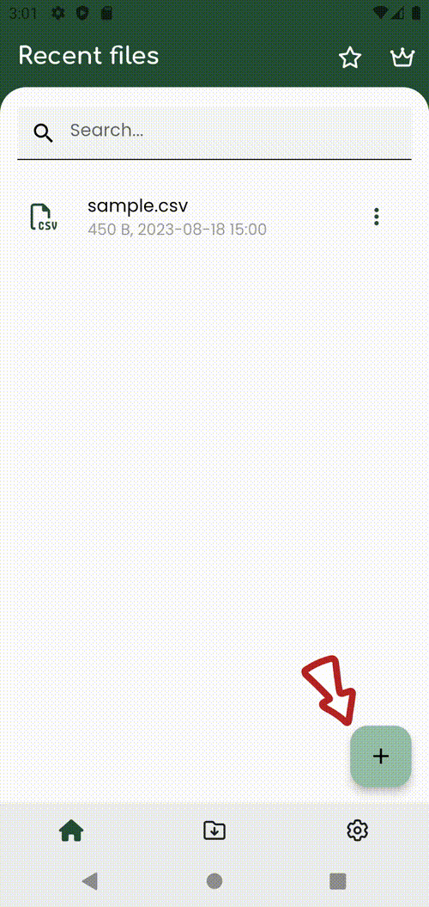
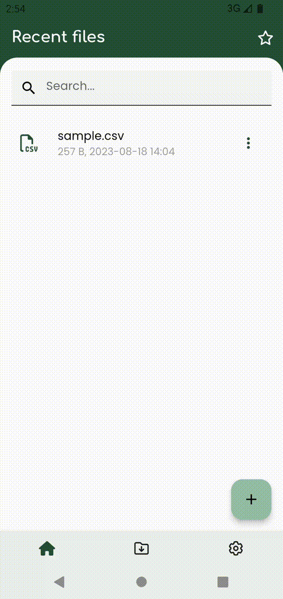
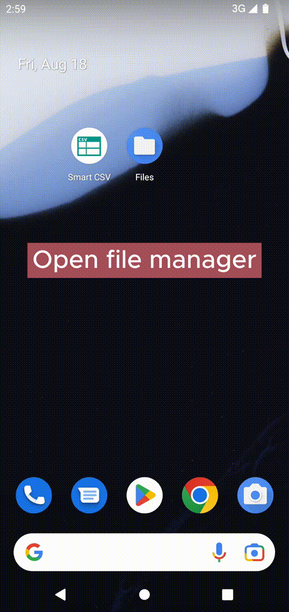
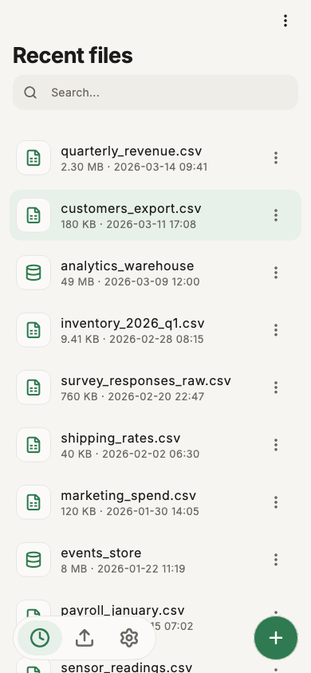
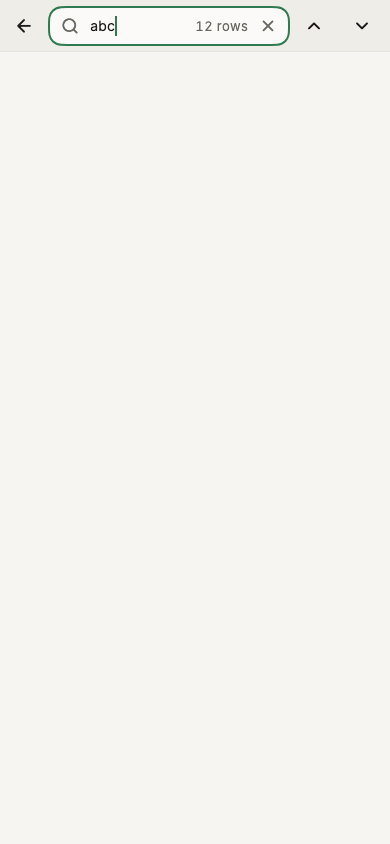
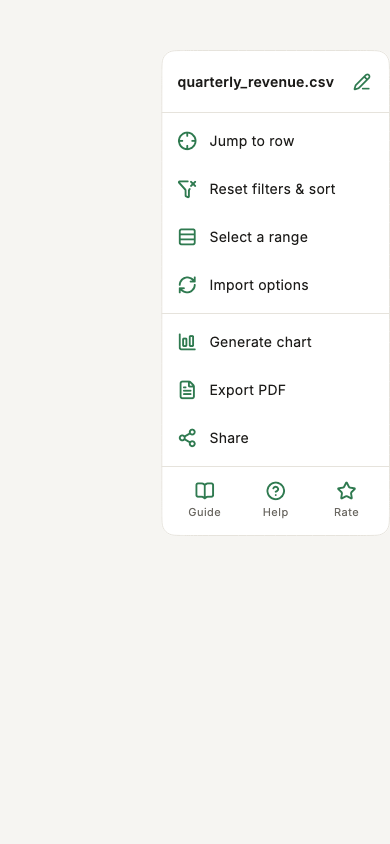

# Basics

## Open file
There are 2 ways to open a csv file:

- [Open from Smart CSV app](#open-from-smart-csv-app)
- [Open from File explorer](#open-from-file-explorer)

### Open from Smart CSV app
- Click on the `+` button.
- `Before Android 13` On the first time, the app will ask permission to open file. So please choose `Allow` to let app access the file.
- After you given the permission, the file picker will be shown, and choose the csv file that you want to open.
- The csv file will be imported to the app, and then the csv viewer will display the csv content.

=== "Before Android 13"
    { width="300" loading=lazy }

=== "Android 13 or Higher"
    { width="300" loading=lazy }

### Open from File explorer
- Open your favorite file explorer application (eg. `Files`).
- Navigate and click on the csv file you want to open.
- The dialog `open with` will be shown.
- Scroll & select `Smart CSV` to use to view the csv file.

=== "Open csv file from File Manager"
    { width="300" loading=lazy }

Every file you open is listed on the home screen, under `Recent files`.

=== "Recent files"
    { width="300" loading=lazy }

!!! note
    Opening a csv file imports it into a local database first. The first time you open a big file, that import may take a moment.
    The next time you open the same file, it opens immediately &mdash; unless the file changed on disk, in which case it is imported again.

---

## Search
Smart CSV let you search content easily. Once the csv file is openned, you can click on the search icon :octicons-search-24:
After the search box open, you can type the text you want to find.

Smart CSV will auto navigate and highlight the row that contain the searched text, and the field shows how many rows match (eg. `12 rows`).
Use the :fontawesome-solid-chevron-up: and :fontawesome-solid-chevron-down: buttons at the end of the toolbar to move to the previous/next matching row.

=== "Search content"
    { width="300" loading=lazy }

The search only looks through the rows currently shown, so an active filter narrows what it searches. Open the search again and your last search is still there, ready to reuse.

---

## Selecting cells, rows & columns

Tap a row number, a column header, or the top-left corner to select everything in it. Tap and drag the dots on the corners of a selection to stretch it. This replaces touching every cell one by one when you want to copy, generate a chart or export to PDF with just part of your data.

While a selection covers more than one cell, a line above the bottom bar shows its size and, for number columns, the sum and average &mdash; tap the line for the full breakdown (count, min, max).

To select a specific range of rows, or jump straight to a row number, tap :material-dots-vertical: at the top right of the viewer:

=== "The ⋮ menu"
    { width="300" loading=lazy }

- **Jump to row** &mdash; type a row number (or tap `Begin`/`End`) and the grid scrolls straight to it.
- **Select a range** &mdash; enter a `from` and `to` row number (eg. `500` to `1000`) to select that whole range.

---

## Column resize

By default, columns size themselves automatically. To change a column's width:

- **Drag it manually.** Long press a column header to bring up the resize handle, then drag.
- **Set every column to one width, or reset to automatic.** Tap a column's header to select it, then open the **Layout** panel at the bottom of the screen: the grid scope's `Column width` slider sets the default width for every column without its own override, and its **Reset** chip clears overrides and goes back to automatic sizing.

Row height (`Small`/`Medium`/`Large`) and how many leading columns are frozen also live in that same Layout panel.

---

## Copy
Select the rows, columns or cells you want to copy &mdash; see [Selecting cells, rows & columns](#selecting-cells-rows-columns) above. If nothing is selected, copying uses every row.

Tap **Copy** in the bar at the bottom of the screen. The selection is copied straight to the clipboard, ready to paste into a spreadsheet.

=== "The bottom dock"
    { width="300" loading=lazy }

To copy, cut, or clear just part of the data, hold a cell, a row number, or a selected range: a menu opens next to your finger with **Copy**, **Cut**, and **Clear content**. For a single cell, that same menu also has **View full content**, which opens a sheet with the cell's whole text and its own **Copy** button.

## Share, rename, remove files
In the home screen, in `Recent files`, tap the three-dot button on a file to share, rename, or remove it.

=== "Share, rename, remove file"
    { width="300" loading=lazy }

---

## Sorting
Hold a column's header to sort by it &mdash; A→Z first, hold again for Z→A, and a third time to go back to the file's own order. An arrow next to the header shows the current direction. You can also sort from the **Filter** panel's **Sort** tab, which supports sorting by up to three columns at once (`Then by this`).

## Undo & redo
Every cell edit, inserted row, deleted row, row move, and column change can be undone. The undo and redo buttons sit at the top of the viewer, next to search, and grey out when there's nothing to undo/redo. Deleting rows or a column also offers an **Undo** action directly on the confirmation message.
