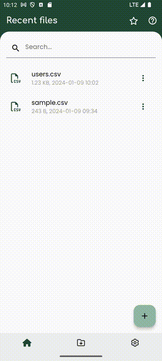

# Show column image url as an image :material-professional-hexagon:{ .pro title="Available for PRO version only" }

Transforming your CSV data, especially when it includes image URLs, into a visually appealing display has never been easier. With SmartCSV, effortlessly convert those image URLs into actual images with just a few clicks. Let us simplify the process for you.

Here's how you can do that:

- Look for and click on the icon that consists of `three dots`. You'll usually find this in the upper right corner of the screen.

- From the options that appear, select `Column to image`

- Upon opening the dialog box, a list of columns will be presented. Simply activate the column containing the image URL to seamlessly showcase it as an image. It's as straightforward as that.

- Once you've made your selection, just click the 'Apply' button to witness the transformation take effect.

=== "Show as column image"
    { width="300" loading=lazy }

!!! note
    Within the column selection dialog, you have the option to streamline the process further. By clicking the 'Auto' button, SmartCSV will intelligently identify columns containing URLs and automatically designate them as image columns. Simplify your workflow with this convenient feature.