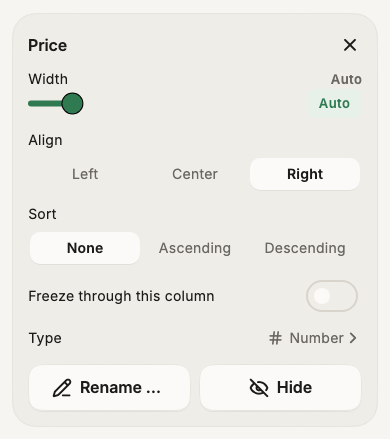

# Column types

A column can be told what its cells hold, and then it looks and works like it: a checkbox column shows boxes you tick, a number column sorts 9 before 10, a date column opens a calendar.

**A type never changes your file.** It only decides how a column looks, sorts and filters. The text in every cell stays exactly as it was. (The one exception is a date column's **Change format…**, which asks first.)

All types are free.

## The types

| Type | What you see | Editing |
|---|---|---|
| **Text** | The text. Web addresses are still tappable. | Type in the cell. |
| **Number** | Right aligned. Optionally shown as `1,234.50`, `$1,234.50` or `25%` &mdash; on screen only. | A number keyboard. |
| **Checkbox** | A box. | Tap the box to tick or untick it. |
| **Select** | Coloured chips. | Tap the cell twice: pick from the list, search, or add a new choice. |
| **Date** | The date as the file writes it. | Tap the cell twice: a calendar. |
| **Link** | Underlined, with an open button. Web pages, e-mail addresses and phone numbers. | Type in the cell. |
| **Image** | A thumbnail of the image at that web address. | Type or paste the address. See [Show column as image](column-to-image.md). |

## Set a type

- Tap the column's header, then **Layout** → **Type** (or **+** → **Column type…**).
- Pick a type. The sheet tells you how many of the column's values fit, for example *312 of 320 values fit*, and shows a few that don't.
- Tap **Apply**. **Undo** takes it back.

=== "Type, in the Layout panel"
    { width="300" loading=lazy }

With several columns selected, one type is applied to all of them.

You can also set types in **Manage columns** (from the **+** menu): each column starts with a type chip. Tap it to see every type and how much of the column fits it, for example *Number 98%*.

### Options

- **Number** &mdash; *Show as*: as in the file, `1,234.5`, currency or percent, and how many decimals. Only the screen and the PDF change.
- **Checkbox** &mdash; the words a tick and an untick are written as. Smart CSV reads them from the column (`TRUE`/`FALSE`, `yes`/`no`, `1`/`0`, `x` and blank…) and writes the same words back, so your file keeps its own style.
- **Select** &mdash; the choices, taken from the column's values. Tap a choice to change its colour, hold it to remove it, or add one. *Allow several choices* is for cells like `red; green`.
- **Date** &mdash; how the file writes its dates, such as `dd/MM/yyyy`. If Smart CSV guessed day and month the wrong way round, pick the right order here.

### Change a date column's format

**Change format…** rewrites every date in the column into another format, for example `03/09/2026` into `2026-09-03`. It says how many dates it will change, and how many values aren't dates (those are left alone), before doing anything. It can be undone.

## Values that don't fit

A value that isn't what its column says &mdash; `n/a` in a number column &mdash; is shown as it is, with a small amber mark in the corner. Nothing stops you typing it. Empty cells never get a mark.

## Types set for you

When a file is opened, Smart CSV looks at its values and sets the types it can be sure of: numbers, checkboxes, dates and links, and only when every value fits. It never guesses select or image.

Open another file with the same columns, and it starts with the types you set before.

## How types change sorting and filtering

- **Sort** by a number or date column goes by value. Checkboxes sort ticked first; selects in the order of their choices.
- **Filter**: number and date columns offer *greater than*, *less than* and *between* first, and compare by value. Checkbox columns have *is checked* and *is not checked*. Select columns lead with *is in*.
- **SQL** compares number and date columns by value too: `WHERE Amount > 100` works on `1,250.00`.
- **Copy** and writing the file always give the text as it is in the cell.
- **PDF** prints ticks as `[x]` and `[ ]`, and numbers in their display format.
