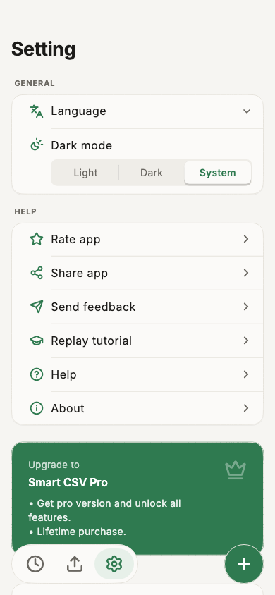

# Customization

Smart CSV supports dark mode and 47+ languages.

To change these, go to the `Home` screen and tap the :fontawesome-solid-gear: button.

## Dark / light mode

Under `Dark mode`, pick:

- `System` &mdash; matches your device's setting.
- `Light` &mdash; always light.
- `Dark` &mdash; always dark.

=== "Settings"
    { width="300" loading=lazy }

## Language

The settings screen also has a `Language` picker, right above `Dark mode`.
