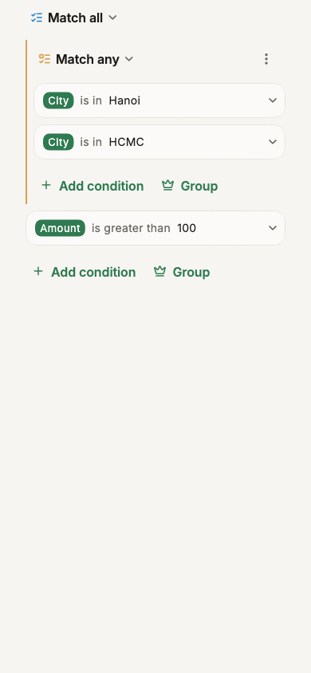

# Filter

Smart CSV provide you a very flexible `Visual Filter Editor`.
To filter the data, tap `Filter` in the bar at the bottom of the screen.

The filter panel comes up over the grid, at about half the screen, and the rows keep scrolling underneath as you build your conditions. Here are some notes before you custom the filter:

- The panel combines conditions with `AND`/`OR`. Tap the group's heading (`Match all`/`Match any`) to change it.
- Tap `Add condition` to add a filter condition for a specific column.
- Tap `Group` (Pro) to add a nested group of its own, combined with `Match all`, `Match any` or `Match none`.

Smart CSV support following compare operators:

- `is equal to`
- `is greater than` 
- `is less than`
- `is between`
- `starts with`
- `ends with`
- `contains`
- `is empty`
- `is not empty`

=== "Visual filter editor"
    { width="300" loading=lazy }

The button at the bottom of the panel says what applying would leave, eg. `Apply · 1,204 rows` &mdash; so you see the effect before you commit. Nothing changes in the grid until you tap it; putting the panel away (dragging it down, or pressing back) keeps every condition you built without applying them.

While a filter is on, a bar under the toolbar shows how many rows match (eg. `1,204 of 40,000 rows`). Tap it to reopen the filter, or tap the `✕` to remove it.

## History

At the top of the filter panel, recent filters show as chips &mdash; tap one to load it. Tap `See all` for the full history of past filters, each undoable if you remove one by mistake.

## Sort

The same panel has a `Sort` tab, next to `Filter`, for sorting by up to three columns. See [Sorting](basics.md#sorting) for the quicker way: just hold a column's header.
