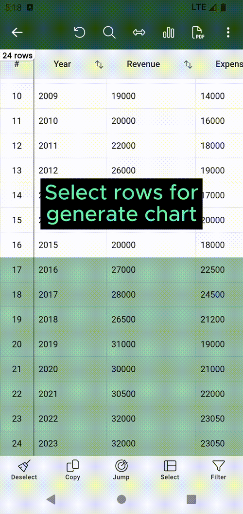

# Generate chart

Smart CSV empowers you to generate charts directly from your CSV content.
Follow these steps to create a chart:

- Select specific rows or all for chart data.
- Click on the :fontawesome-solid-chart-simple: button (on the top of screen).
- [Custom chart types](#custom-chart-type), [labels](#custom-labels) & [series](#custom-series) to match your request.
- Finally, click on the :octicons-download-16: button to save the chart.

=== "Generate chart"
    { width="300" loading=lazy }

!!! warning
    You can only generate chart if the data contains at least on serier (a column that contains number value).

!!! note
    You can view your chart file in the :material-folder-download: (exported) tab in the Home screen.

## Custom chart type
You can click on the `Type` button to select chart type.

Smart CSV support following chart types:

- Column chart.
- Bar chart.
- Line chart.
- Area chart. :material-professional-hexagon:{ .pro title="Available for PRO version only" }
- Spline chart. :material-professional-hexagon:{ .pro title="Available for PRO version only" }
- Scatter chart. :material-professional-hexagon:{ .pro title="Available for PRO version only" }
- Step line chart. :material-professional-hexagon:{ .pro title="Available for PRO version only" }
- Step area chart. :material-professional-hexagon:{ .pro title="Available for PRO version only" }
- Pie chart. :material-professional-hexagon:{ .pro title="Available for PRO version only" }
- Doughnut chart. :material-professional-hexagon:{ .pro title="Available for PRO version only" }
- Pyramid chart. :material-professional-hexagon:{ .pro title="Available for PRO version only" }

## Custom labels
You can click on the `Labels` button to select label which is used for the chart.

## Custom series
You can click on the `Series` button to select the series data point to mapping with above labels for the chart.

