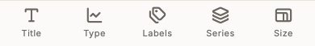

# Generate chart

Smart CSV empowers you to generate charts directly from your CSV content.
Follow these steps to create a chart:

- Select specific rows or all for chart data.
- Tap :material-dots-vertical: at the top right of the viewer, then `Generate chart`.
- [Custom chart type](#custom-chart-type), [labels](#custom-labels), [series](#custom-series) & [size](#custom-size) to match your request.
- Finally, click on the :octicons-download-16: button to save the chart.

=== "Chart type & column picker"
    { width="300" loading=lazy }

!!! warning
    You can only generate chart if the data contains at least on serier (a column that contains number value).

!!! note
    You can view your chart file in the :material-folder-download: (exported) tab in the Home screen.

## Custom chart type
The chart type is a strip of options right under the app bar &mdash; tap the type you want and the chart updates immediately.

Smart CSV support following chart types:

- Column chart.
- Bar chart.
- Line chart.
- Area chart. :material-professional-hexagon:{ .pro title="Available for PRO version only" }
- Spline chart. :material-professional-hexagon:{ .pro title="Available for PRO version only" }
- Scatter chart. :material-professional-hexagon:{ .pro title="Available for PRO version only" }
- Step line chart. :material-professional-hexagon:{ .pro title="Available for PRO version only" }
- Step area chart. :material-professional-hexagon:{ .pro title="Available for PRO version only" }
- Pie chart. :material-professional-hexagon:{ .pro title="Available for PRO version only" }
- Doughnut chart. :material-professional-hexagon:{ .pro title="Available for PRO version only" }
- Pyramid chart. :material-professional-hexagon:{ .pro title="Available for PRO version only" }

## Custom title
Tap the chart's title, at the top of the screen, to rename it directly &mdash; there's no separate dialog.

## Custom labels
Tap `Labels` in the bottom bar to select the column used to label the chart. The picker opens as a panel above the bar, live over the chart, rather than a dialog.

## Custom series
Tap `Series` in the bottom bar to select the series data points to map with the labels above.

## Custom size
Tap `Size` in the bottom bar to set the exported chart image's width and height.
