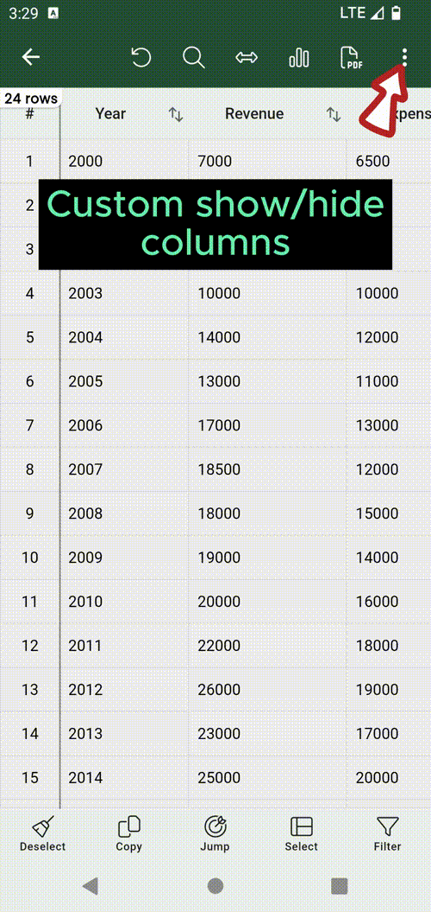
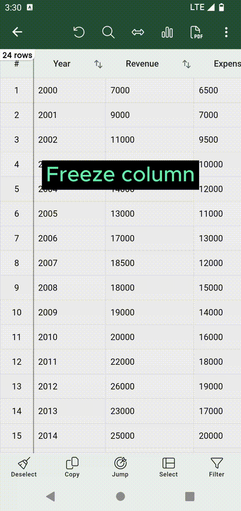

# Show, hide, freeze column.

## Show, hide columns.
There are instances where you might find yourself dealing with a large number of columns in a display, and you might want to hide specific ones for a cleaner view. Here's how you can do that:

- Look for and click on the icon that consists of `three dots`. You'll usually find this in the upper right corner of the screen.

- From the options that appear, select `Show/hide columns.`

- A dialog box will open. In this box, you'll see a list of columns with checkboxes next to them. To hide a column, simply uncheck the box next to its name.

- Once you've unchecked the columns you want to hide, finalize your choices by clicking the `Set` button.

=== "Show/hide columns"
    { width="300" loading=lazy }

## Freeze column.
To ensure certain columns remain visible even during horizontal scrolling, follow these steps:

- Locate and click on the `Three-dot` icon situated in the upper-right corner of the screen.

- Opt for the `Freeze column` feature from the menu that appears.

- A dialog box will open, presenting you with the columns available for freezing. Here, choose the specific column you wish to keep in view.

- Solidify your choice by clicking the `Select` button.

=== "Freeze column"
    { width="300" loading=lazy }
