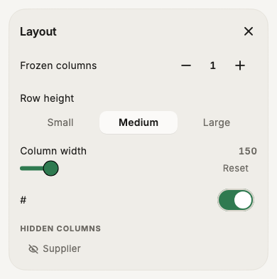

# Show, hide, freeze column.

Column settings live in the **Layout panel**, opened by tapping a column's header, then the **Layout** slot in the bottom bar. The panel sits over the grid so you can see the effect immediately &mdash; tapping a different header retargets it without closing it.

=== "The Layout panel, for one column"
    { width="300" loading=lazy }

=== "The Layout panel, for the whole grid"
    { width="300" loading=lazy }

## Show, hide columns.

- Tap the header of the column you want to hide, then tap **Layout**.
- In the panel, tap **Hide**.
- The column disappears from the grid and, once nothing is selected, shows up as a chip under **Hidden columns** in the panel's grid view.

To bring a hidden column back, tap its chip under **Hidden columns** (or tap **Show all** when there's more than one).

## Freeze column.

To keep certain leading columns visible while you scroll horizontally:

- With nothing (or a row) selected, open **Layout**.
- Use the **Frozen columns** stepper to set how many columns, counted from the left, stay in place.

Alternatively, select a column band and toggle **Freeze through this column** &mdash; the frozen count becomes that band's last column, plus one.
