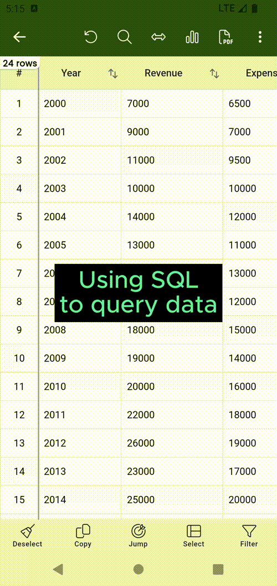

# SQL query :material-professional-hexagon:{ .pro title="Available for PRO version only" }


Sometimes the filter `Visual Editor` is not enough. So Smart CSV bring to you a more
advanced feature to extract the data by using `SQL Query`.

## How it works?

When you open the csv file, Smart CSV will import csv data to the local sqlite database. That is also the reason, why you open the csv file next time, the file looks like open immediately, even with the big file.

So, because it is imported to sqlite database, then you will free to using sql query
to query your data.

**Here are some notes:**

- The csv table name is: `CSV`
- The column names are: `A`, `B`, `C`, ..., `Z`. There is a map column name with the alias header name at the bottom of `SQL Query` screen.
- You only do one sql query statment at the same time. Otherwise, the error alert will notice you.


For example, we have a following csv content:

| Year | Revenue | Expensive |
|------|---------|-----------|
| 2020 | 30000   | 21000     |
| 2021 | 30500   | 22000     |
| 2022 | 32000   | 23050     |


So we will have following columns:

- `A` -> `Year`
- `B` -> `Revenue`
- `C` -> `Expensive`


Now, the query to show all data since 2021 is:

```sql
SELECT * FROM CSV -- (1)
WHERE A >= 2021 -- (2)
```

1.  :man_raising_hand: `CSV` is the table name.
2.  :man_raising_hand: `A` is the column name that mapped with `Year.`


=== "SQL query"
    { width="300" loading=lazy }

There is also a `History` button at the bottom of `SQL Query` screen, which allow you to access all history sql query.
