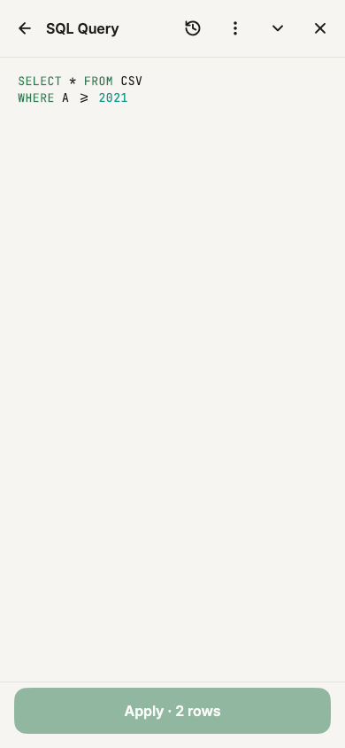

# SQL query :material-professional-hexagon:{ .pro title="Available for PRO version only" }


Sometimes the `Visual Filter Editor` is not enough. So Smart CSV bring to you a more
advanced feature to extract the data by using `SQL Query`.

## How it works?

When you open the csv file, Smart CSV will import csv data to the local sqlite database. That is also the reason, why you open the csv file next time, the file looks like open immediately, even with the big file.

So, because it is imported to sqlite database, then you will free to using sql query
to query your data.

**Here are some notes:**

- The csv table name is: `CSV`
- The column names are: `A`, `B`, `C`, ..., `Z`. There is a map column name with the alias header name at the bottom of the SQL editor.
- You only do one sql query statment at the same time. Otherwise, the error alert will notice you.


For example, we have a following csv content:

| Year | Revenue | Expensive |
|------|---------|-----------|
| 2020 | 30000   | 21000     |
| 2021 | 30500   | 22000     |
| 2022 | 32000   | 23050     |


So we will have following columns:

- `A` -> `Year`
- `B` -> `Revenue`
- `C` -> `Expensive`


Now, the query to show all data since 2021 is:

```sql
SELECT * FROM CSV -- (1)
WHERE A >= 2021 -- (2)
```

1.  :man_raising_hand: `CSV` is the table name.
2.  :man_raising_hand: `A` is the column name that mapped with `Year.`


## Where to find it

SQL is not a separate screen anymore. Tap `Filter` at the bottom of the screen, then `Edit as SQL` inside the panel. The editor opens with the query your visual conditions already amount to, so you can start from there or clear it and write your own.

=== "SQL query"
    { width="300" loading=lazy }

While you type, the `Apply` button previews the result, eg. `Apply · 1,204 rows`. If SQLite can't run the query, the error appears above the editor and `Apply` waits until you fix it; if the query matches nothing, `Apply` is disabled and says `No rows match`.

Two rows of shortcuts appear above the keyboard: tap a column to insert its (quoted) name, or tap a key such as `LIKE '%%'`, `AND` to insert it.

There is also a history button in the SQL editor's header, which gives you access to your past queries. Templates for common needs (show/hide duplicate rows, hide empty rows) are in the `⋯` menu.

!!! note
    Leaving the SQL editor with `←` throws the query away and goes back to your visual conditions &mdash; a query can't be turned back into conditions. `✕`, swiping down, or Back only close the panel; your query is kept for next time.

    On the free tier, `Edit as SQL` shows how many free queries you have left.
